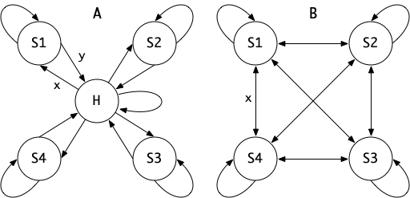

README for HMMSTAR
==================

Nucleotide Viterbi decoder with k-mer tables.

## Model ##

HMMSTAR is a Viterbi decoder for nucleotide sequences. State emissions are
modeled by a file of k-mer probabilities. The states can be connected either in
a star pattern with a central hub (A in the figure below) or in fully-connected
pattern with no central hub (B in the figure below).

In a _star_ model, there are two state-switching probabilities, one from the hub
to the spokes (X), and one for the spokes to the hub (Y).

In an _full_ model, the probability for switching states (X) is identical for
all states.

The probabilities of the self-returning transitions is of course 1 minus all of
the outgoing probabilities in each state.

The `-x` and `-y` parameters control X and Y while the `-f` switch selects the
full model (default is star).
